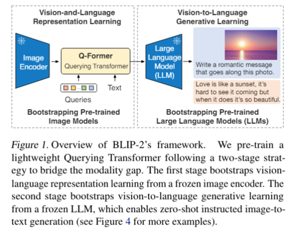
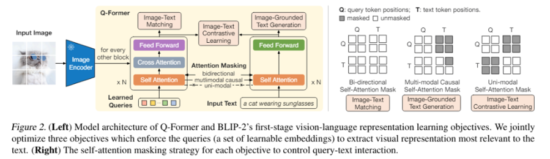

# Q-Former(Querying Transformer)

- frozen image encoder와 frozen llm 사이 information bottleneck으로 작용
- query: 이미지가 있고 특정 text가 주어졌을 때 둘을 alignment하는데 활용될 수 있는 feature를 추출
    1. vision language representation learning: q-former가 text와 가장 관련있는 visual representation을 얻도록 함
    2. Q-Former의 출력을 고정된 LLM에 연결하여 vision to language generative learning을 수행하고 출력 시각적 표현을 LLM에서 해석할 수 있도록 Q-Former를 training

## Architecture
- 2개의 주 component로 구성: Image Transformer, Querying Transformer
-  Q-Former의 encoder-decoder 구조에 대해서 causality만 조절해줌으로써 encoder에서와 decoder에서 각각의 task에 맞는 optimization이 진행

### Image Transformer

- visual encoder로서 작용
- input image에서 의미있는 feature를 뽑아냄
- learnable querry vectors를 이용해 frozen image encoder로부터 visual features 추출
- vision language representation learning: q-former가 text와 가장 관련있는 visual representation을 얻도록 함

### Querying Transformer

- extracted visual features를 기반으로 dynamic queries 를 생성하여 이미지와 텍스트 각 도메인에서의 가교로 활용
- Q-Former의 출력을 고정된 LLM에 연결하여 vision to language generative learning을 수행하고 출력 시각적 표현을 LLM에서 해석할 수 있도록 Q-Former를 training